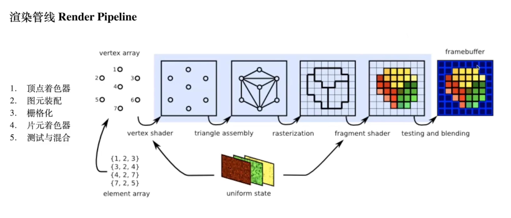

## Metal
* 标准化：提供面向 3D 图像和数据并行化计算范式。
* 更底层：提供更底层的 API 访问 GPU。
* 低开销：通过提供多线程计算和预编译资源来降低运行时消耗。

除了以上所说，Metal 不但使用了大量的 GPU 并行计算的能力来进行数据可视化或做数学计算，还可定制化于机器学习、图片和视频处理或图形图像渲染。

WWDC14 推出基于 C++11 的 MSL（Metal Shading Language）。

GPU 的优化方向是“在单位时间内可以处理多少数据”，而 CPU 的优化方向是“处理单个数据需要花费多少时间”。

### 基础知识

#### 渲染流程

**什么是渲染？**

在 3D 计算机图形学下，把一堆点汇集在一起创建出一副图像，这个图像就被称为渲染。

### 文章链接
- [Metal - Apple](https://developer.apple.com/documentation/metal)
- [Metal 语法说明](https://xiaozhuanlan.com/star)
- [iOS 图像处理](https://xiaozhuanlan.com/colin)

### 代码链接
- [LearnMetal](https://github.com/loyinglin/LearnMetal)
- [Metal-Practice](https://github.com/colin1994/Metal-Practice)