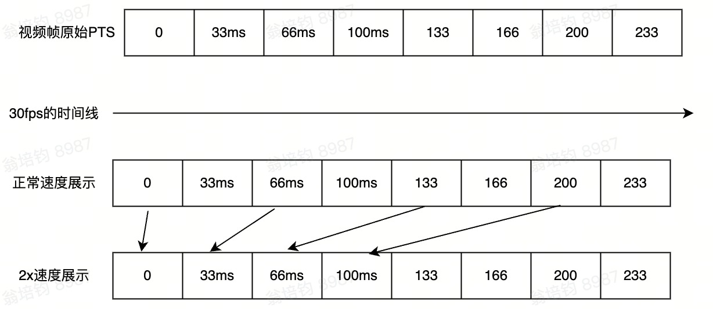

## feature

### 视频变速

变速的本质：就是修改视频帧的时间戳。比如2倍速，就是 视频帧的pts（Presentation Time Stamp/显示时间戳）=原始帧pts/2，0.5倍速，就是 视频视频帧的pts=原始帧pts/0.5；外部取帧逻辑这些是不变的。

普通变速和曲线变速的区别
* 普通变速：速度是恒定的，整个视频的帧的pts计算方法是固定的，只需要除以一个固定的速度。
* 曲线变速：曲线变速的速度不是固定的，具体的计算公式根据不同的曲线类型而不同

逆变速也是一样的道理，但稍微麻烦一些。