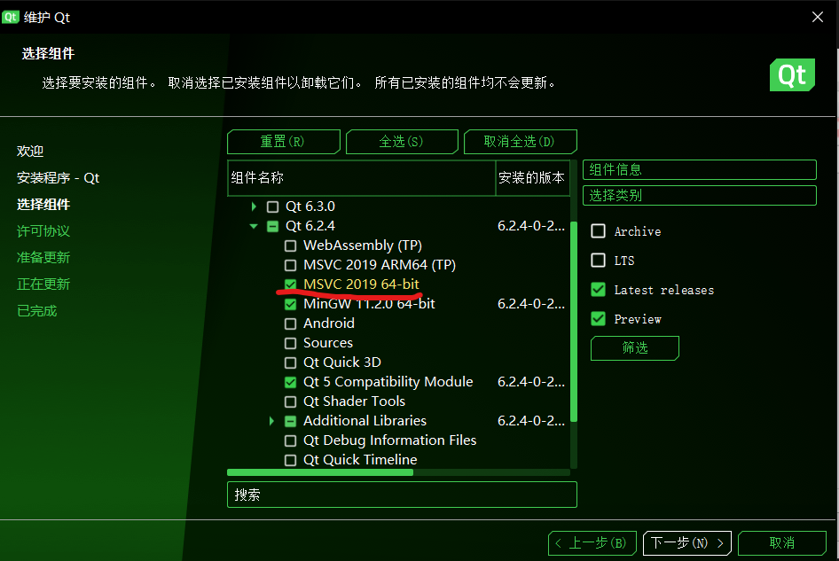
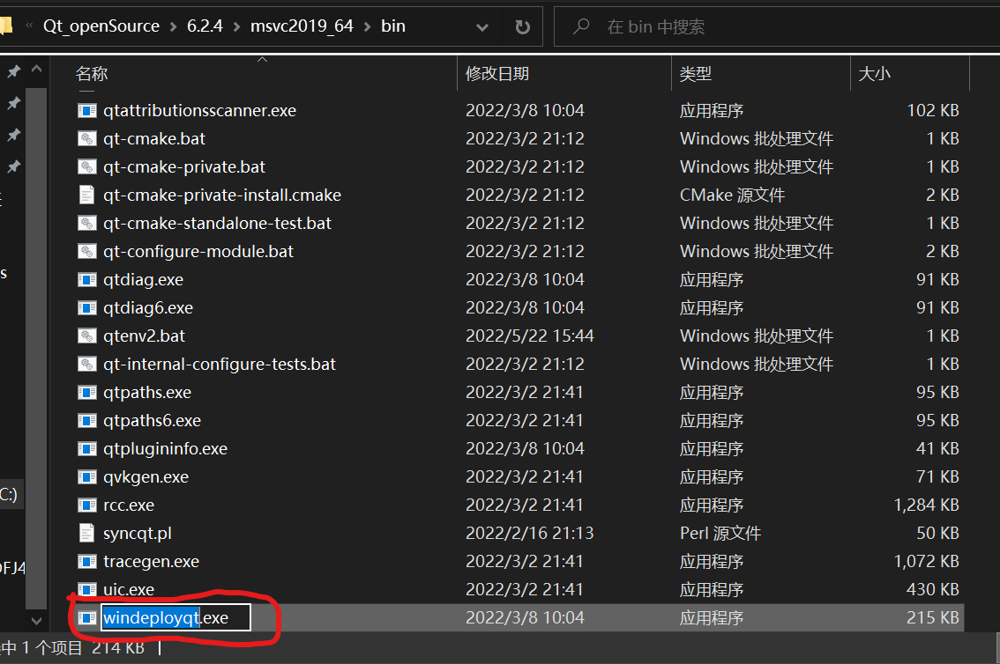
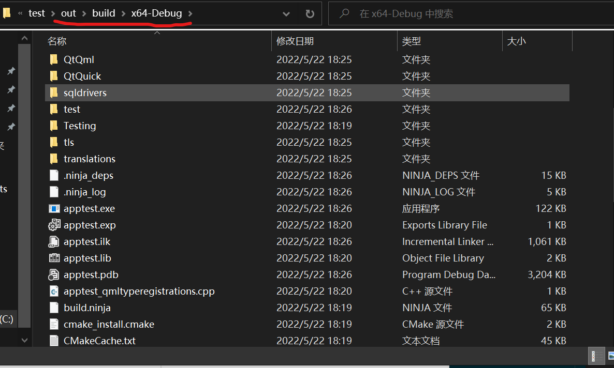

## 内存管理

### Qt 对象树内存管理机制
Qt 是一个基于 C++ 的跨平台 GUI 框架，C++ 本身是没有自动垃圾回收机制的，但 Qt 为了解决 C++ 中大量重复性的 `new` 和 `delete`，引入了“对象树”的“半自动内存管理机制”。在 Qt 中所有的 C++ 类如果想要利用上 Qt 的对象树内存管理机制，需要派生自 `QObject`。`QObject` 中有 `parent` 字段标记了其父对象指针，以及 `list` 容器对象保存了所有子对象指针。如果一个对象的 `parent` 非 0，则该对象 `parent` 在执行析构时会析构该对象。

可以手动设置一个对象的 `parent` 对象，需要注意二者需要在同一线程。

### 利用智能指针优化内存管理

```C++
#include <QApplication>
#include <QLabel>

int main(int argc, char *argv[]) {
    QApplication app(argc, argv);
    QLabel *label = new QLabel("PJHubs");
    label->show();
    return app.exec();
}
```

在 QtWidgets 下这是一份非常典型的内存泄露代码，修复该问题可以有：

* 将 label 对象分配到 stack 中而不是 heap（堆）中。
* 给 label 设置标记位 `Qt::WA_DeleteOnClose`。
* 手动调用 `delete`。
* 使用智能指针。

前三种比较熟悉了，而使用智能指针可以写出以下逻辑：

```C++
std::auto_ptr<QLabel> label(new QLabel("PJHubs"));
```

详见[这篇文章](https://blog.csdn.net/L_Andy/article/details/107645633)。


## 工程配置

### 使用 VS 进行开发

#### 设置 Qt 版本路径
如果默认使用 Qt Creator 进行开发毫无问题，但都已经使用 win 了不好好利用上 vs 实在是浪费。在 vs 中下载好对于的 qt 拓展插件后，extensions 中找到 qt tools，选择 msvs 版本的构建工具路径即可。



#### 构建 Qt 程序

**CMake 生成 VS 工程**
下载好 msvs 构建工具后，执行 `cmake ..` 默认通过 msvs 构建工具生成 vs 工程。

**VS 直接打开 CMake 工程**
VS - file - Open - CMake

**设置 Qt SDK 索引**

这里比较奇怪，如果我们使用的时 Qt Creator 进行开发，创建好工程后一路顺畅直接 build 即可，而且工程目录下也没有生成任何的冗余 IDE 相关文件，但生成 vs 工程后会多出大量的 vs IDE 相关的文件不说，此时直接跑 CMakeLists.txt 会提示需要添加 Qt6 目录。

`set(CMAKE_PREFIX_PATH your_qt_file_path/6.2.4/msvc2019_64)`

**自动补齐依赖**

自动补齐 Qt app 运行时依赖的 dll 动态库

`qt_file_path/bin/windeployqt.exe your_app_fila_path/apptest.exe`



等待一会儿后，对应的 `out` 目录下补齐了一堆缺失的动态库，此时就可以正常通过 vs IDE 来愉快的进行 Qt 开发了。




## 线程/异步

### QThread

不要使用  `run` 方法来完成，对创建出线程对象和操作对象当前所处线程有要求，直接通过 `moveToThred` 方式创建，并可采用 `QMetaObject::invokeMethod` 注入线程操作。


### QFuture

* 基于 `Qt::Concurrent` 实现。
* QFuture 运行线程同步的获得一个或多个在将来某个时间点才准备好的结果。
* 这些结果可以时任何具有默认构造函数和拷贝构造函数的类型。
* 如果在调用该类的 `result()`、`resultAt()`、`results()` 函数时某个结果还不可用，QFuture 会等待直到结果可用。
* 可用使用 `isResualtReadyAy()` 来判断某个结果是否已经准备好。
* `waitForFinished()` 函数调用会导致调用线程阻塞来等待异步计算结束，以确保所有的结果都是可用的。

`QFuture` 不支持信号和槽，`QFutureWatcher` 可支持，可读取到任务状态。


工程里没有搜到用该方式的地方，可参考文章：
* [使用QFuture类监控异步计算的结果](https://blog.csdn.net/Amnes1a/article/details/65630701)
* [QFuture的使用：多线程与进度条](https://blog.csdn.net/gongjianbo1992/article/details/106957888/)
