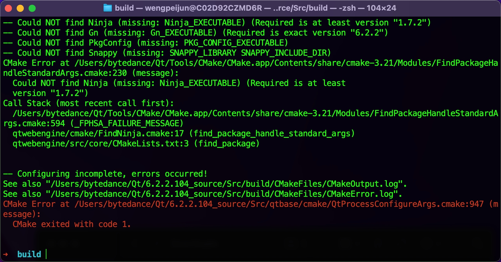

## 本地构建 Qt
去 [download.qt.io](https://download.qt.io/archive/qt/) 下载对应的 Qt 源码后，可用通过该[文档中的方式](https://wiki.qt.io/Building_Qt_6_from_Git)本地自行构建 Qt 二进制。

直接执行 `./configura` 可能回到下图中的问题:

原因很奇怪，说是对应的 ninja 版本太老，但纳闷的是这 ninja 不是集成在内部的嘛，刚开始以为真的是 ninja 版本的问题所以还是去到 github 下了一份新版 ninja，但问题依旧，仔细想了想，还是决定先把关联出错的 `qtwebengin` 组件给移除了，遂成行。

最终执行 `cmake --build .` 后开始了漫长的等待，应该一开始就把不需要的 qt 组件全都给移除，build qt 的过程实在是漫长。

最后再执行 `cmake --install .` 即可拿到二进制包，集成只 Qt Creator 或 CMakeLists 中写明版本即可。

### 通过 MaintenaceTool 工具安装
可以下载到完整的二进制包，避免本地 build 过程耗时将近 2 小时。

## 路径转换

因为历史原因 win 平台上文件路径都是以 `/` 反斜杠切割，除此之外的所有系统均以 `\` 正斜杆来切割。在 Qt 中为了解决不同平台之间的路径切割符的问题，可用使用 `QDir::toNativeSeparators()` 方法进行转换