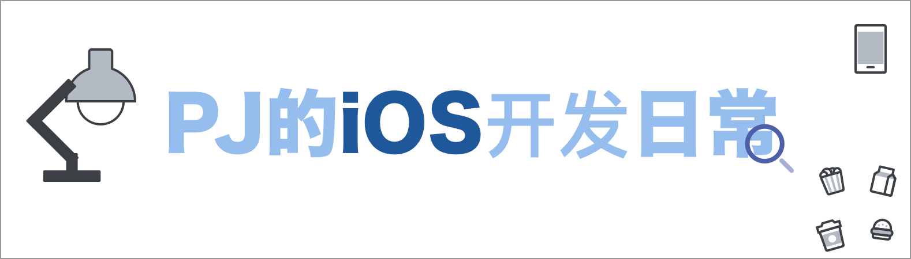

## 🤘 前言

这是我在学习iOS开发相关内容过程中的总结，包括在日常coding、工作中、灵光一闪后的想法时间等都会在此进行分析总结。因为自己的时间关系，很多想要总结出来的内容往往会拖延一段时间才正式完成，因此设立了以下状态供大家进行参考。

👨🏻‍💻 编写中 | ✅ 已完成

欢迎star、fork、PR。[一篇老文](./简介.md)，当初开这个库时的一些想法。

##  iOS

[✅ 招一个靠谱的iOS实习生（附参考答案）](./iOS/招一个靠谱的iOS实习生（附参考答案）.md)

#### 🏯 文化

[✅ 苹果公司的历史](./iOS/文化/2_Apple_History.md)

[✅ macOS的历史](./iOS/文化/3_Mac_OS_X.md)

[✅ iOS的历史](./iOS/文化/4_iOS.md)

#### 🛠 相关工具使用

[👨🏻‍💻百家汇](./iOS/相关工具使用/2_百家汇.md)

[👨🏻‍💻GitHub](./iOS/相关工具使用/3_GitHub.md)

[👨🏻‍💻Xcode](./iOS/相关工具使用/4_Xcode.md)

[👨🏻‍💻开发中可能会用到的内容](./iOS/相关工具使用/开发中可能会用到的内容.md)

## 🗣 语言

[👨🏻‍💻Objective-C](./语言/2_Objective-C.md)

[👨🏻‍💻Swift](./语言/3_Swift.md)

[✅More-页面传值](./语言/More-页面传值.md)

[✅More-架构设计](./语言/More-DesignPattern.md)

[✅More-国际化一站式解决方案](./语言/More-iOS国际化一站式解决方案.md)

## 🔶 UI

[👨🏻‍💻什么是UI？](./UI/2_什么是UI？.md)

[👨🏻‍💻StoryBoard](./UI/3_StoryBoard.md)

[✅More-弹幕](./UI/More-弹幕.md)

[👨🏻‍💻UITableView相关使用总结](./UI/UITableView使用相关总结.md)

## 📚 教程

[👨🏻‍💻计算器](./项目及教程/计算器.md)

[✅剪刀石头布](./项目及教程/剪刀石头布.md)

## 🏗 项目

[✅iBistu 4.0开发总结](./项目/iBistu4-0（先导篇）.md)

[✅小程序初探](./项目/小程序初探.md)

[✅小程序初探（二）](./项目/小程序初探（二）.md)

[✅React-Native记〇](./项目/React-Native记〇.md)

[✅React-Native记（一）](./项目/React-Native记（一）.md)

[✅React-Native记（二）](./项目/React-Native记（二）.md)

## ⚙️ SDK及框架

[✅More-iOS开发中Audio相关内容](./SDK及框架/More-Audio.md)

[✅ONEUIKit-ONEProgressHUD](./SDK及框架/ONEUIKit-ONEProgressHUD.md)

## 💻 macOS

[✅macOS开发（词法分析器）](./macOS/macOS开发（词法分析器）.md)

## 🔗 相关技术博客汇总

[sunnyxx、](http://blog.sunnyxx.com/)
[tutuge、](http://tutuge.me/)
[ibireme、](https://blog.ibireme.com/)
[casatwy、](https://casatwy.com/index.html)
[mrpeak、](http://mrpeak.cn/)
[nshipster、](http://nshipster.cn/translators/april-peng/)
[onevcat、](https://onevcat.com/#blog)
[cnbluebox、](https://blog.cnbluebox.com/)
[starming、](http://www.starming.com/)
[ioszen、](http://ioszen.com/blog/)
[zhrmoe、](http://zhrmoe.com/)
[billhubo、](https://blog.billhubo.com/)
[iming、](http://blog.iming.org/)
[qyizhong、](http://www.qyizhong.cn/)
[xuzhengke、](http://www.xuzhengke.cn/)
[pjhubs、](http://pjhubs.com/)
